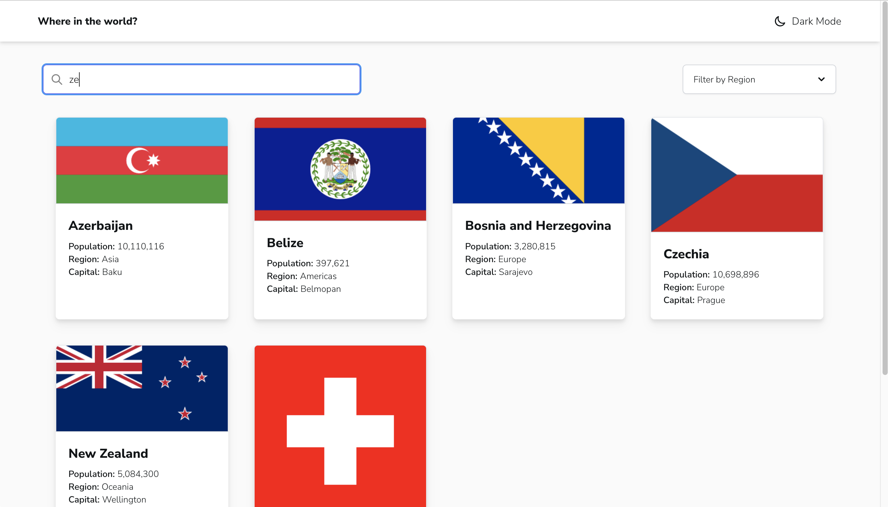
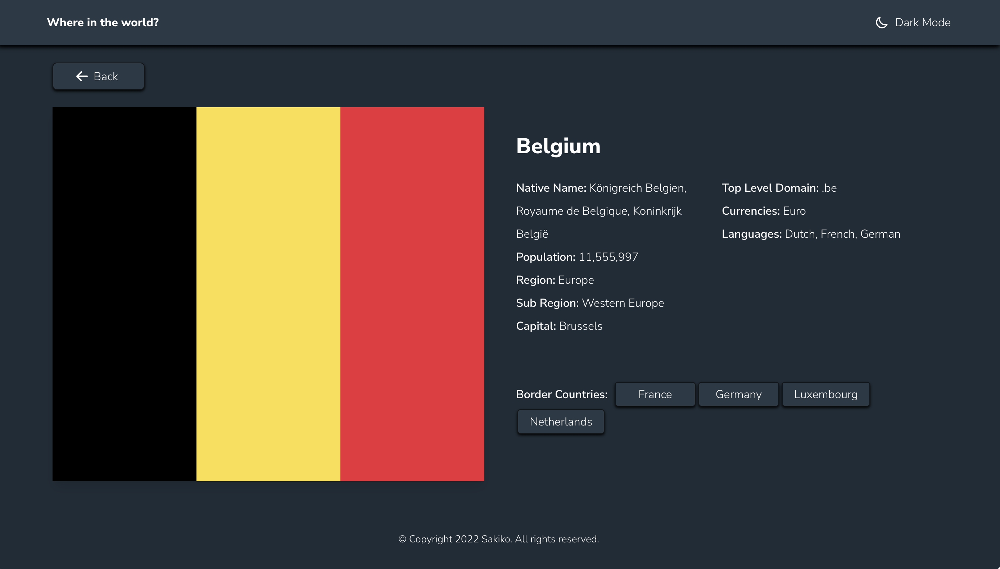
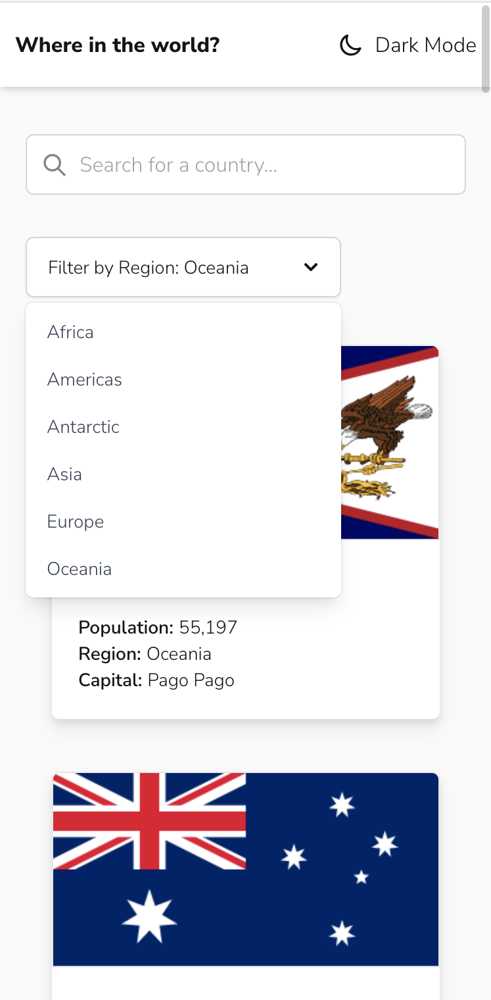
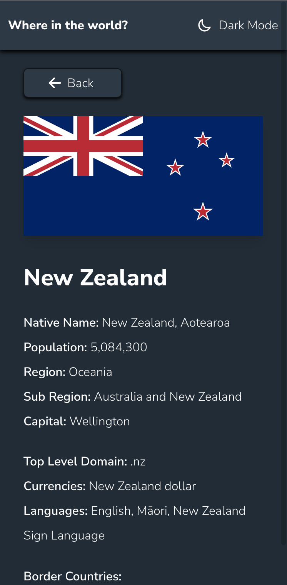

# Country Search App

## Screenshots

  <h3>Desktop</h3>
  
  

 

  <h3>Mobile</h3>
  
  

 

## Built with

- [Create React App](https://github.com/facebook/create-react-app) - CLI tool to
  setup React.js Web App
- [React Router DOM](https://github.com/remix-run/react-router/tree/main/packages/react-router-dom) -
  Routing
- [Tailwind CSS](https://github.com/tailwindlabs/tailwindcss) - Utility-first
  CSS framework
- [Heroicons](https://github.com/tailwindlabs/heroicons) - SVG icons
- [Headless UI](https://github.com/tailwindlabs/headlessui) - UI component
- [Styled-components](https://github.com/styled-components/styled-components) -
  CSS-in-JS framework
- [REST Countries](https://restcountries.com/) - Countries data API
- [Frontend Mentor - REST Countries API with color theme switcher](https://github.com/frontendmentorio/rest-countries-api-with-color-theme-switcher) -
  App idea, design
